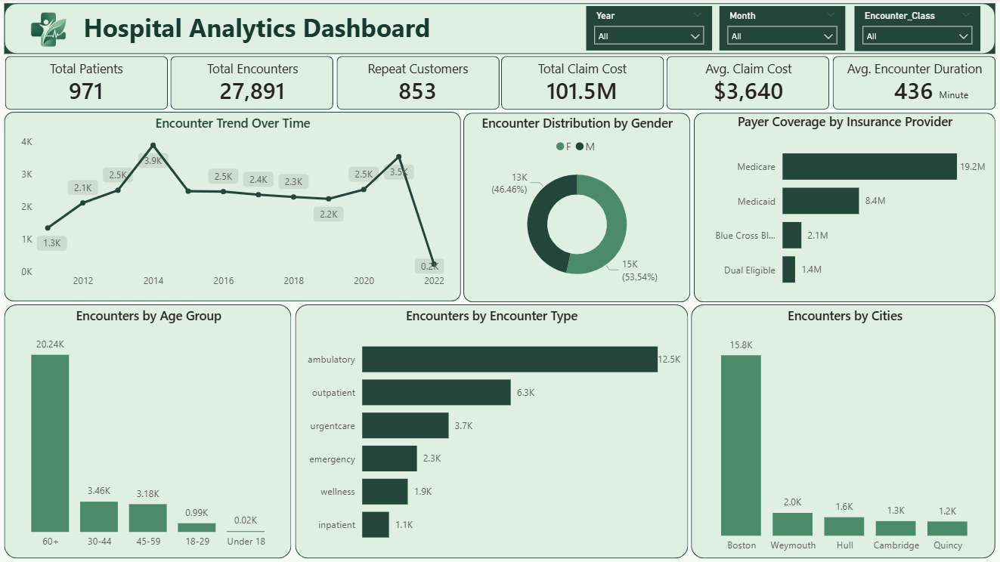

# Hospital Analytics Dashboard

> An interactive healthcare analytics dashboard built using **Microsoft Excel, SQL Server, and Power BI** to analyze patient utilization, encounter patterns, payer coverage, healthcare costs, demographics, and geographic demand.

---

# Dashboard Preview

## Hospital Analytics Overview

The dashboard provides an executive-level view of hospital activity through KPIs and interactive analysis of patient encounters, encounter types, payer coverage, patient demographics, geographic distribution, and healthcare costs.

---

# Problem Statement

The hospital needed a centralized analytics solution to understand:

- How patient encounters change over time
- Which encounter types generate the highest patient volume
- Which age groups contribute the most healthcare utilization
- Which geographic locations generate the highest number of encounters
- Which insurance providers contribute the most payer coverage
- How much the hospital is spending per encounter
- How frequently patients return to the hospital

This project transforms raw healthcare data into an interactive business intelligence solution using **Excel for basic data preparation, SQL Server for data modeling and validation, and Power BI for analysis and visualization.**

---

# Dataset

The dataset contains healthcare-related information covering patients, encounters, and payer/insurance information.

---

# Data Preparation & Transformation

The project follows a simple **Excel → SQL Server → Power BI** analytics workflow.

## Microsoft Excel

Excel was used for basic data cleaning and preparation:

- Removed unnecessary columns
- Standardized column names
- Combined first and last names into patient names
- Checked for duplicate records
- Checked for missing values
- Standardized data types
- Performed basic data validation

Excel was used only for **initial data preparation**.

---

## SQL Server

SQL Server was used for data organization, transformation, validation, and analytical preparation.

Key activities included:

- Created dimension and fact tables
- Validated primary and foreign key relationships
- Checked duplicate encounter IDs
- Validated encounter types
- Validated cost-related fields
- Created encounter class dimension
- Created date dimension
- Structured the data using a star schema
- Validated KPI calculations before Power BI visualization

---

# Power BI

Power BI was used for the main analytics and dashboard development.

Key features include:

- Star schema data modeling
- DAX measures
- KPI development
- Interactive visualizations
- Slicers
- Time-based analysis
- Demographic analysis
- Payer analysis
- Encounter analysis
- Geographic analysis
- Data-driven business insights

---

# Dashboard Components

## 1. Executive KPIs

The dashboard provides the following key metrics:

- Total Patients
- Total Encounters
- Repeat Patients
- Total Claim Cost
- Average Claim Cost
- Average Encounter Duration

These KPIs provide a quick overview of overall hospital utilization and financial activity.

---

## 2. Encounter Trend Over Time

Analyzes how the number of hospital encounters changes across years.

This helps identify:

- Periods of increasing demand
- Historical peaks
- Declining or unusual periods
- Potential data completeness issues

---

## 3. Encounter Distribution by Gender

Shows the distribution of encounters between male and female patients.

This helps understand whether healthcare utilization is significantly concentrated within a particular gender group.

---

## 4. Encounters by Encounter Type

Analyzes encounter volume across:

- Ambulatory
- Outpatient
- Urgent Care
- Emergency
- Wellness
- Inpatient

This helps identify the hospital's primary sources of patient utilization.

---

## 5. Payer Coverage by Insurance Provider

Analyzes payer coverage across major insurance providers such as:

- Medicare
- Medicaid
- Blue Cross Blue Shield
- Dual Eligible

This provides visibility into the hospital's payer mix and financial coverage.

---

## 6. Encounters by Age Group

Analyzes healthcare utilization across different age groups:

- Under 18
- 18–29
- 30–44
- 45–59
- 60+

This helps identify the patient segments generating the highest healthcare demand.

---

## 7. Encounters by Patient Location

Analyzes encounter volume by patient city.

This helps identify geographic concentration and understand where the hospital's patient demand is coming from.

---

# Key Business Insights

## 1. Hospital Utilization Is Heavily Concentrated in Ambulatory and Outpatient Care

Ambulatory and outpatient encounters together account for approximately **67% of total encounters**.

This indicates that the hospital's operational demand is driven primarily by non-inpatient services rather than hospital admissions.

### Business implication

The hospital should prioritize:

- Outpatient capacity planning
- Appointment availability
- Staffing optimization
- Patient flow management
- Ambulatory service efficiency

---

## 2. Patients Aged 60+ Drive the Majority of Healthcare Utilization

Patients aged **60+ account for approximately 73% of recorded encounters**.

This is one of the strongest signals in the analysis and indicates that healthcare utilization is heavily concentrated among older patients.

### Business implication

The hospital could strengthen:

- Senior-focused healthcare programs
- Chronic-care management
- Preventive care
- Follow-up services
- Medication management
- Care coordination

The analysis should focus on understanding whether these encounters are planned recurring care or potentially avoidable repeat utilization.

---

## 3. Repeat Patient Utilization Is Extremely High

The dashboard shows **853 repeat patients out of 971 total patients**, meaning approximately **88% of patients are classified as repeat patients**.

This indicates that recurring patient utilization is a major characteristic of the hospital's activity.

### Business implication

Repeat utilization should be segmented into:

- Planned follow-up visits
- Necessary recurring treatment
- Potentially avoidable repeat visits

The goal should not simply be to reduce repeat visits, but to understand whether repeated utilization reflects effective ongoing care or operational inefficiencies.

---

# Business Recommendations

## 1. Optimize Ambulatory and Outpatient Capacity

Since the majority of encounters occur in ambulatory and outpatient settings, the hospital should focus on improving capacity and patient flow in these services.

Recommended actions:

- Analyze peak appointment periods
- Optimize staff scheduling
- Increase capacity during high-demand periods
- Reduce patient waiting time
- Improve appointment utilization
- Identify operational bottlenecks

The objective is to handle higher patient demand without proportionally increasing operating costs.

---

## 2. Develop an Elderly-Focused Care Strategy

With approximately 73% of encounters associated with patients aged 60+, elderly healthcare should become an important planning consideration.

Recommended initiatives:

- Structured follow-up programs
- Preventive health checkups
- Chronic-care management
- Medication reviews
- Specialist coordination
- Remote or telephone follow-ups where appropriate

The objective should be to provide better coordinated care while reducing unnecessary hospital utilization.

---

## 3. Analyze Repeat Patient Behavior

A high repeat-patient rate requires deeper analysis rather than simply treating repeat visits as positive or negative.

Patients should be segmented based on:

- Encounter frequency
- Time between visits
- Encounter type
- Patient age
- Reason for encounter
- Total claim cost

This can help distinguish healthy recurring care from potentially avoidable utilization.

---

# Strategic Business Framework

| Business Signal | What It Indicates | Recommended Action |
|---|---|---|
| High Ambulatory Volume | Strong outpatient demand | **Optimize Capacity** |
| High 60+ Utilization | Elderly-driven demand | **Develop Senior Care** |
| High Repeat Patients | Recurring utilization | **Analyze Patient Journeys** |
| High Boston Concentration | Geographic demand concentration | **Strengthen Local Operations** |
| Medicare & Medicaid Dominance | Payer concentration | **Optimize Financial Strategy** |

---

# Conclusion

This project demonstrates how raw healthcare data can be transformed into an interactive business intelligence solution using **Microsoft Excel, SQL Server, and Power BI**.

The analysis identifies five major strategic areas:

- High dependence on ambulatory and outpatient services
- Strong healthcare utilization among patients aged 60+
- High repeat patient utilization
- Significant geographic concentration around Boston
- Strong dependence on Medicare and Medicaid coverage

The dashboard goes beyond descriptive reporting by connecting these patterns to operational capacity, elderly care strategy, patient utilization, geographic planning, and payer-level financial management.

The overall objective is to help hospital management move from **reactive reporting to data-driven operational and strategic decision-making**.

---

# Contact

Email: ishantkatiyar68@gmail.com  
LinkedIn: https://www.linkedin.com/in/ishantkatiyar/
